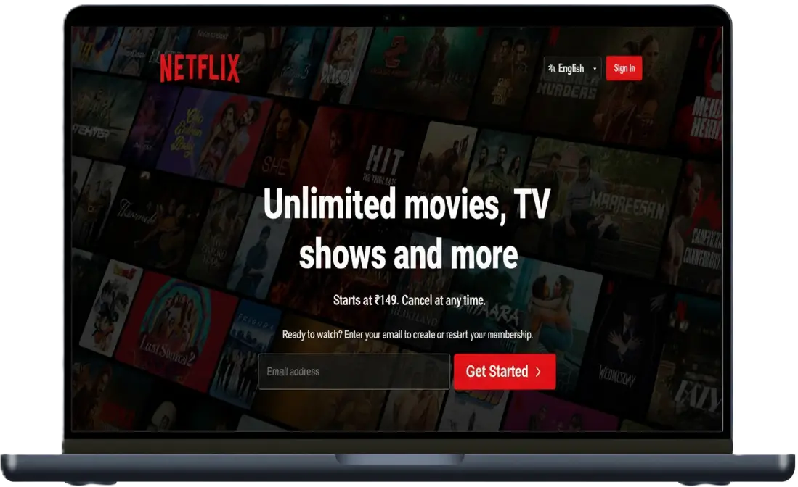

# Netflix Clone

[](https://opensource.org/licenses/MIT)

## 📖 Description

This project is a visually identical and fully responsive clone of the Netflix homepage, engineered to capture its premium, cinematic user experience. It was built from the ground up using modern HTML5 and CSS3, with a mobile-first approach to ensure a pixel-perfect and seamless layout across all devices, from mobile phones to desktops.

## 🎥 Live Demo

**Live Demo:** [Netflix Clone](https://n-flix-clone-ui.netlify.app/)

## 📸 Screenshot



## ✨ Features

-   **High-Fidelity UI/UX:** A visually accurate clone of the Netflix user interface, including the navigation bar, hero section, and feature cards.

-   **Dynamic Content Carousel:** An interactive, horizontally scrolling carousel for the "Trending Now" section, complete with dynamic navigation buttons powered by JavaScript.

-   **Fully Responsive Design:** Ensures a seamless viewing experience on desktop, tablet, and mobile devices, built with modern Flexbox and Grid layouts.

-   **Advanced CSS Styling:** Utilizes modern CSS for custom-styled UI elements, including a unique dropdown menu for language selection.

## 🛠️ Tech Stack

-   HTML5
-   CSS3 (Flexbox, Grid, Media Queries)
-   JavaScript (ES6)
-   Google Fonts

## ⚙️ Installation

No installation is required. Simply clone the repository to your local machine.

1.  Clone the repo:
    ```bash
    git clone https://github.com/Vansh-Malik-01/Netflix-Clone.git
    ```

## 🚀 Usage

To view and use the project, simply open the `index.html` file in your web browser.

For the best experience, it is recommended to run it with a live server. A popular choice is the **Live Server** extension for VS Code.

## 🤝 Contributing

Contributions are what make the open-source community such an amazing place to learn, inspire, and create. Any contributions you make are **greatly appreciated**.

If you have a suggestion that would make this better, please fork the repo and create a pull request. You can also simply open an issue with the tag "enhancement".

1.  Fork the Project
2.  Create your Feature Branch (`git checkout -b feature/AmazingFeature`)
3.  Commit your Changes (`git commit -m 'Add some AmazingFeature'`)
4.  Push to the Branch (`git push origin feature/AmazingFeature`)
5.  Open a Pull Request

## 📄 License

Distributed under the MIT License.

## 📬 Contact

Vansh Malik – [vanshmalik.dev@gmail.com
](mailto:vanshmalik.dev@gmail.com
)

LinkedIn: [https://www.linkedin.com/in/vansh-malik-coder](https://www.linkedin.com/in/vansh-malik-coder)
